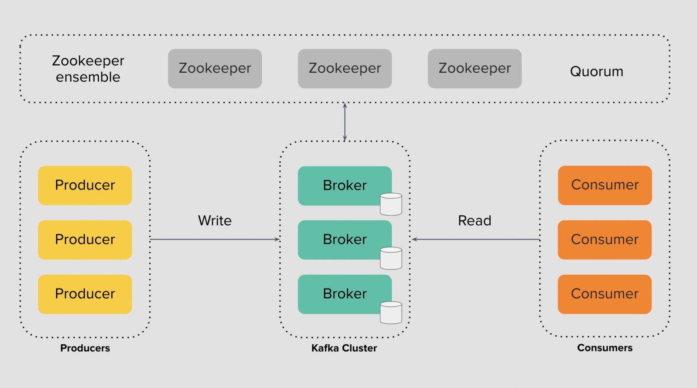
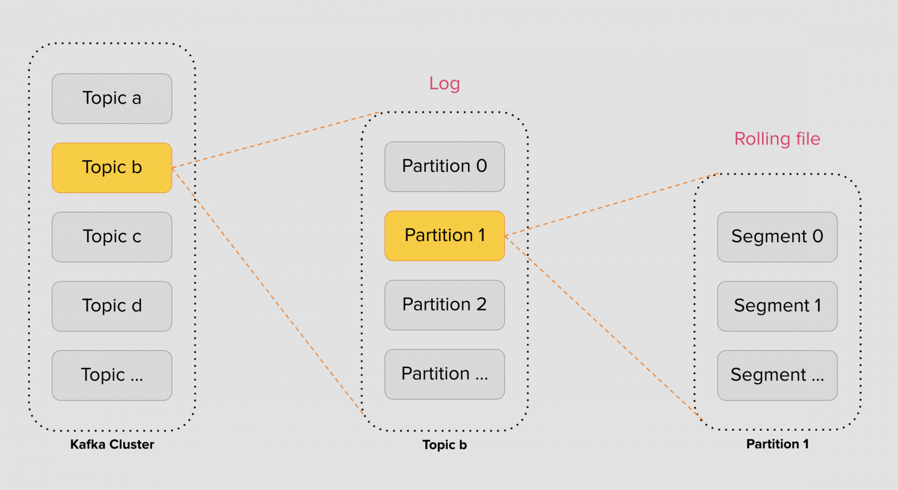
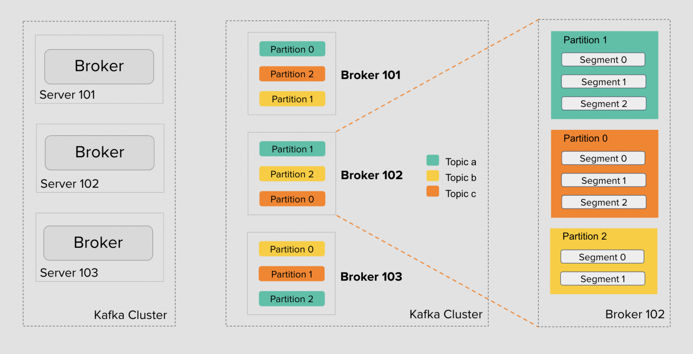
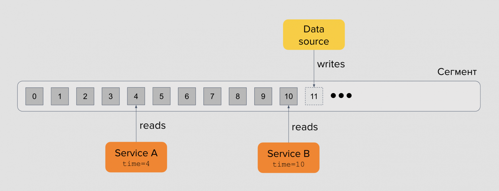
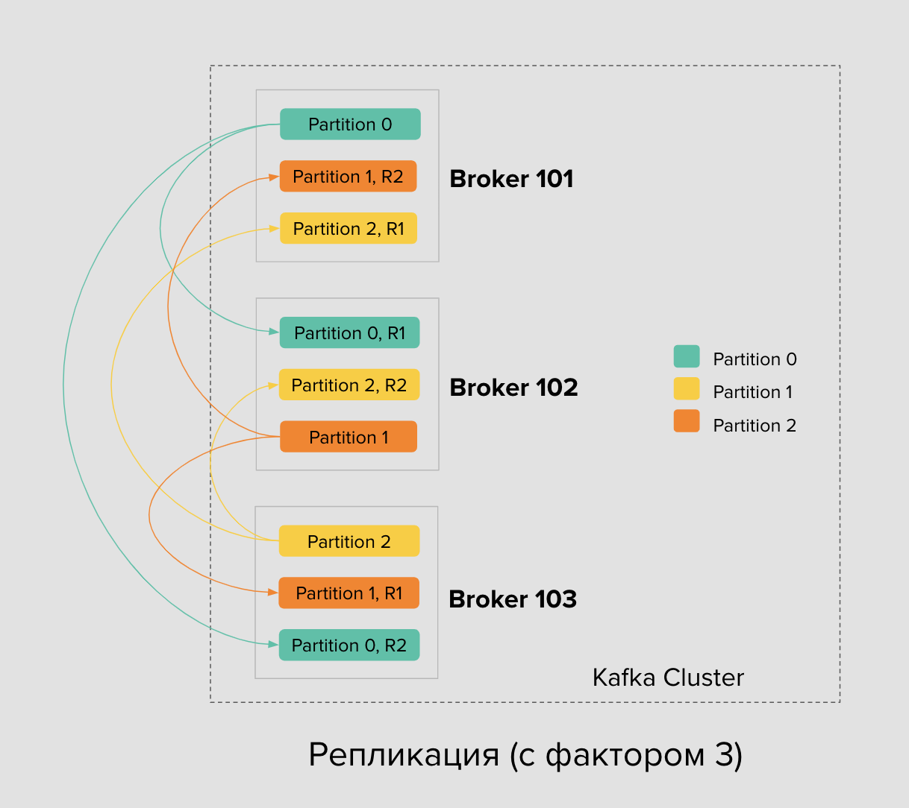
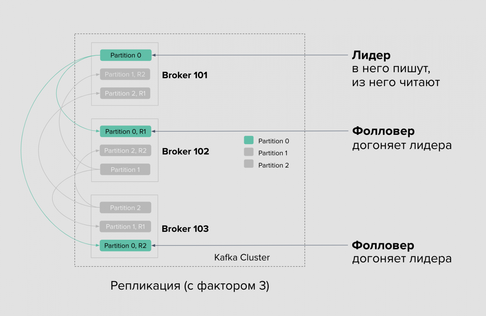
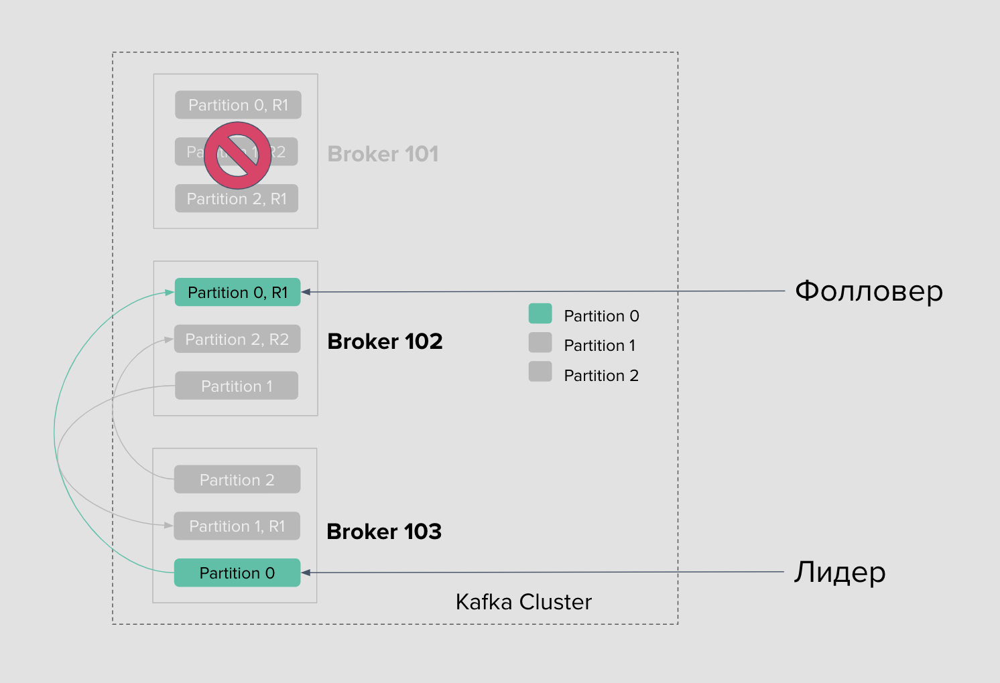

###  Kafka: устройство

---
**Предыстория**

Долгое время инженеры разрабатывали программы, которые оперируют объектами реального мира
и сохраняют состояние о них в базы данных. Это могли быть пользователи, заказы или товары.
Представление о вещах мира как объектах широко распространено в парадигме ООП и разработке
в целом. Но всё больше современных компаний оперируют не самими объектами, а событиями,
которые они порождают.

Компании стремятся снизить тесную связь сервисов друг с другом и улучшить устойчивость
приложений к сбоям за счёт изоляции поставщиков данных и их потребителей. Этот запрос
вместе с популярностью микросервисной архитектуры как раз и популяризует
событийно-ориентированный подход.

События в системах можно хранить в традиционных реляционных базах данных так же как объекты.
Но делать так громоздко и неэффективно. Вместо этого мы используем структуру под названием
лог, о которой и поговорим далее.

---
**Как устроен Apache Kafka**

Основы кластера Kafka — это `продюсер`, `брокер` и `консьюмер`.
Продюсер пишет сообщения в лог брокера, а консьюмер его читает.

📜 `Лог` — это упорядоченный поток событий во времени.
Событие происходит, попадает в конец лога и остаётся там неизменным.

✉️ `Продюсеры`
Для записи событий в кластер Kafka есть продюсеры — это приложения, которые вы разрабатываете.
Программа-продюсер записывает сообщение в Kafka, тот сохраняет события, возвращает подтверждение о записи или
acknowledgement.
Продюсер получает его и начинает следующую запись.

🖥️ `Kafka-брокер` — это сервер (экземпляр) в кластере Apache Kafka,
который отвечает за хранение данных, поступающих от производителей (producers),
и их передачу потребителям (consumers).
При первом знакомстве думайте о Kafka-брокере как о компьютере: это процесс в операционной системе с доступом к своему
локальному диску.
Брокеры обрабатывают все запросы на запись и чтение сообщений,
а также участвуют в репликации данных для обеспечения надежности и отказоустойчивости системы.
Все брокеры соединены друг с другом сетью и действуют сообща, образуя единый кластер. Когда мы говорим, что продюсеры
пишут события в Kafka-кластер, то подразумеваем, что они работают с брокерами в нём.

Кстати, в облачной среде кластер не обязательно работает на выделенных серверах — это могут быть виртуальные машины или
контейнеры в Kubernetes.

Ключевые функции Kafka-брокера:

- Хранение данных: Брокеры хранят сообщения в бинарном формате в логических потоках данных,
называемых топиками.

- Обработка запросов: Брокеры принимают сообщения от продюсеров и обслуживают запросы на чтение от консьюмеров.

- Репликация данных: Для повышения надежности брокеры реплицируют (копируют) партиции топиков на другие брокеры в
кластере.

- Управление партициями: Каждый топик разделяется на партиции,
которые позволяют распределить данные по разным брокерам и ускорить работу системы.

- Координация: В кластере один из брокеров назначается ведущим (controller), который координирует работу остальных
брокеров и поддерживает целостность данных.

📥 `консьюмеры` - события, которые продюсеры записывают на локальные диски брокеров,
могут читать консьюмеры — это тоже приложения, которые вы разрабатываете.
В этом случае кластер Kafka — это по-прежнему нечто, что обслуживается инфраструктурой,
где вы как пользователь пишете продюсеров и консьюмеров.
Программа-консьюмер подписывается на события и получает данные в ответ.
Так продолжается по кругу.

---
**Архитектура Kafka**

Посмотрим на архитектуру Kafka более внимательно. Слева есть продюсеры,
в середине брокеры, справа — консьюмеры. Инструмент представляет собой
группу брокеров, связанных с Zookeeper-кворумом. Kafka использует Zookeeper
для достижения консенсуса состояния в распределённой системе: есть несколько
вещей, с которыми должен быть «согласен» каждый брокер и Zookeeper помогает
достичь этого «согласия» внутри кластера.



🦓 `Zookeeper` — это выделенный кластер серверов для образования
кворума-согласия и поддержки внутренних процессов Kafka.
Благодаря этому инструменту мы можем управлять кластером Kafka:
добавлять пользователей и топики, задавать им настройки.
Также Zookeeper помогает обнаружить сбои контроллера, выбрать новый
и сохранить работоспособность кластера Kafka. А ещё он хранит в себе все
авторизационные данные и ограничения или Access Control Lists при работе
консьюмеров и продюсеров с брокерами.

📦 `Топик` — это логическое разделение категорий сообщений на группы.
Например, события по статусам заказов, координат партнёров, маршрутных листов
и так далее.

💡Ключевое слово здесь — логическое. Мы создаём топики для событий общей группы и стараемся не смешивать их друг с другом.
Например, координаты партнёров не должны быть в том же топике, что и статусы заказов, а обновлённые статусы по заказам
не стоит складывать вперемешку с обновлением регистраций пользователей.
Топик удобно представлять как лог — вы пишете событие в конец и не разрушаете
при этом цепочку старых событий.

Общая логика:
- Один продюсер может писать в один или несколько топиков.

- Один консьюмер может читать один или несколько топиков.

- В один топик могут писать один или более продюсеров.

- Из одного топика могут читать один или более консьюмеров.

⚠️ Теоретически, нет никаких ограничений на число этих топиков, но практически это ограничено числом партиций.

---

**Партиции и сегменты**

Ограничений на количество топиков в кластере Kafka нет,
но есть ограничения самого компьютера. Он выполняет операции на
процессоре, вводе-выводе, и в итоге упирается в свой предел.
Мы не можем увеличивать мощность и производительность машин бесконечно,
а потому топик следует делить на части.



В Kafka эти части называются 🗂️`партициями`. Каждый топик состоит из одной или более партиций, каждая из которых может
быть размещена на разных брокерах. За счёт этого Kafka может масштабироваться: пользователь может создать топик,
разделить его на партиции и разместить каждую из них на отдельном брокере.

Формально партиция и есть строго упорядоченный лог сообщений. Каждое сообщение в ней добавлено в конец без возможности
изменить его в будущем и как-то повлиять на уже записанные сообщения. При этом сам топик в целом не имеет никакого
порядка, но порядок сообщений всегда есть в одной из его партиций.

Сами партиции физически представлены на дисках в виде сегментов. Это отдельные файлы, которые можно создать, ротировать
или удалить в соответствии с настройкой устаревания данных в них. Обычно вам не приходится часто вспоминать о сегментах
партиций, если вы не администрируете кластер, но важно помнить саму модель хранения данных в топиках Kafka.

💡 Разберём детали на примере. 

В кластере Kafka есть три брокера: 101, 102 и 103. Топик A отмечен 🟢 бирюзовым, топик B — 🟡
жёлтым, C — 🟠 оранжевым. На картинке у каждого топика по три партиции, но их число может быть разным и настраивается для
каждого топика.



Партиции распределены между брокерами — кластер Kafka делает это автоматически при создании топика. Инструмент
автоматически не следит за размером каждой партиции, не занимается ребалансировкой записи и чтения в кластере, не
перемещает партиции между брокерами. Для этого уже существуют opensource-инструменты и готовые enterprise-платформы как
Confluent, но сейчас для нас это не важно.

⚠️ Каждая партиция на брокере представлена набором сегментов. Число сегментов у партиций тоже может быть разным. Оно
варьируется в зависимости от интенсивности записи и настроек размера сегмента.

В итоге, мы можем увеличивать число брокеров в кластере и тем самым масштабировать систему. Kafka поддерживает
добавление или удаление брокеров. А с помощью встроенных инструментов можно, например, переносить партиции между
брокерами чтобы равномерно их распределять.

Можно также добавлять новые партиции в топике — это увеличит параллелизм записи и чтения со стороны продюсера и
консьюмера.

Наконец, можно изменять настройки 📄`сегментов`, чтобы управлять частотой и интенсивностью ротации отдельных файлов на
дисках брокеров. 

💡 Рассмотрим устройство сегмента подробнее:

Сегмент тоже удобно представить как обычный лог-файл: каждая следующая запись добавляется в конец файла и не меняет
предыдущих записей. Фактически это очередь FIFO (First-In-First-Out) и Kafka реализует именно эту модель.

Семантически и физически сообщения внутри сегмента не могут быть удалены, они иммутабельны. Всё, что мы можем — указать,
как долго Kafka-брокер будет хранить события через настройку политики устаревания данных или Retention Policy.

Числа внутри сегмента — это реальные сообщения системы, у которых есть порядковые номера или оффсеты, что монотонно
увеличиваются со временем. У каждой партиции свой собственный счётчик, и он никак не пересекается с другими партициями —
позиции 0, 1, 2, 3 и так далее у каждой партиции свои. Таким образом, продюсеры пишут сообщения в партиции, а брокер
адресует каждое из таких сообщений своим порядковым номером.

Помимо продюсеров, что пишут сообщения, есть `консьюмеры`, которые их читают. У лога может быть несколько консьюмеров,
которые читают его с разных позиций, и не мешают друг другу. А ещё у консьюмеров нет жёсткой привязки к чтению событий по
времени. При желании они могут читать спустя дни, недели, месяцы, или вовсе несколько раз спустя какое-то время.


Начальная позиция первого сообщения в логе называется `log-start offset`. Позиция сообщения, записанного последним —
log-end offset. Позиция консьюмера сейчас — current offset.


Расстояние между конечным оффсетом и текущим оффсетом консьюмера называют `лагом` — это первое, за чем стоит следить в
своих приложениях. Допустимый лаг для каждого приложения свой, это тесно связано с бизнес-логикой и требованиями к
работе системы.

---

**Политика устаревания данных или Retention Policy**

Это настройка в Apache Kafka, определяющая, как долго или сколько данных будет храниться в топике перед тем, как они
будут помечены для удаления с диска. Эта политика необходима для управления дисковым пространством, поскольку брокеры
сообщений, в отличие от традиционных очередей, не удаляют сообщения автоматически после доставки потребителю. Политика
может быть основана на времени (Time-Based Retention Policy) или на размере (Size-Based Retention Policy).

Типы политики хранения:

- Политика хранения по времени (`Time-Based Retention Policy`): Сообщения удаляются, когда их возраст превышает заданное
  пороговое значение (например, 7 дней).
- Политика хранения по размеру (`Size-Based Retention Policy`): Сообщения удаляются, когда общий объем данных в топике
  превышает заданный размер (например, 1 ГБ).

---

**Репликация данных**

Если одна партиция будет существовать на одном брокере, в случае сбоя часть данных станет недоступной. Такая система
будет хрупкой и ненадёжной. Для решения проблемы Kafka представляет механизм репликации партиций между брокерами.

У каждой партиции есть настраиваемое число `реплик`, на изображении их три. Одна из этих реплик называется лидером,
остальные — фолловерами. Продюсер подключается к брокеру, на котором расположена лидер-партиция, чтобы записать в неё
данные.

Записанные в лидера данные автоматически реплицируются фолловерами внутри кластера Kafka. Они подключаются к лидеру,
читают данные и асинхронно сохраняют к себе на диск. В настроенном кластере Kafka репликация обычно занимает доли
секунд.

консьюмеры со своей стороны также читают из лидерской партиции — это позволяет достичь консистентности при работе с
данными. Задача фолловеров здесь как и в предыдущем случае сводится к копированию данных от лидера.

💡 С версии 2.4 Kafka поддерживает чтение консьюмерами из фолловеров, основываясь на их взаимном расположении. Это полезно
для сокращения задержек при обращении к ближайшему брокеру в одной зоне доступности. Однако, из-за асинхронной работы
репликации, взамен вы получаете от фолловеров менее актуальные данные, чем они есть в лидерской партиции.


Роли лидеров и фолловеров не статичны. Kafka автоматически выбирает роли для партиций в кластере. Например, в случае
сбоя брокера, роль лидера достанется одной из реплик, а консьюмеры и продюсеры должны получить обновления согласно
протоколу и переподключиться к брокерам с новыми лидерами партиций.

---

**Log compaction (сжатие журнала)**

Это метод очистки файлов логов или потоков данных, при котором сохраняется только последнее обновление для каждого
уникального ключа в логе.
Это означает, что для каждого ключа, независимо от количества записанных обновлений, сохраняется только одно значение —
последнее. Старые значения удаляются, что не только экономит место, но и повышает производительность системы в плане
времени извлечения данных.
Log compaction используется, например, в Apache Kafka для восстановления к состоянию до сбоя приложения или системы, а
также при перезагрузке кеша после перезапуска приложения.

---
**Порядок внутри партиции**

Внутри каждой партиции Apache Kafka сообщения строго упорядочены в том порядке, в котором они были добавлены в эту
партицию. Этот порядок гарантируется благодаря тому, что каждому сообщению присваивается уникальный смещение (`offset`), а
сообщения с одинаковым ключом всегда попадают в одну и ту же партицию, сохраняя свой порядок.

⚠️ Однако порядок сообщений не гарантируется между разными партициями одного топика, так как они обрабатываются независимо и параллельно.
Как обеспечивается порядок внутри партиции

- `Смещение (Offset)`: Каждое сообщение в партиции получает уникальный порядковый номер (смещение) при записи. Это
  позволяет потребителям считывать сообщения в том же порядке, в котором они были добавлены.
- `Ключ сообщения`: При отправке сообщений продюсер может указать ключ. Kafka гарантирует, что все сообщения с одним и
  тем же ключом будут отправлены в одну и ту же партицию, что обеспечивает строгий порядок их обработки.

**Ограничения порядка**

- `Параллельная обработка партиций`: Топики могут иметь несколько партиций, которые обрабатываются независимо. Это
  означает, что порядок сообщений между разными партициями не гарантируется, поскольку они могут обрабатываться
  параллельно.
- `Распределение по ключам`: Если в сообщениях отсутствует ключ или используются разные ключи, сообщения будут
  распределяться по партициям более-менее равномерно. В таком случае порядок сообщений из одной партиции не будет
  отражать общий порядок сообщений во всем топике.

**Как использовать порядок сообщений**

- `Потребительские группы`: При использовании потребительских групп (consumer groups) каждая партиция закрепляется за
  одним потребителем в группе. Это позволяет сохранять порядок, поскольку один потребитель обрабатывает все сообщения из
  одной партиции последовательно.
- `Анализ данных`: Если вам важен строгий порядок событий для определенной сущности (например, для пользователя),
  используйте ключ сообщения, равный идентификатору этой сущности, чтобы все связанные с ней события попали в одну
  партицию.

---
**Ключи и стратегия partitioning**

🔑 `Ключ партиции` в Apache Kafka используется для детерминированного распределения сообщений по разделам (партициям):
сообщения с одинаковым ключом всегда отправляются в одну и ту же партицию, сохраняя при этом порядок обработки. Если
ключ отсутствует, сообщения распределяются между партициями циклически, что обеспечивает равномерное распределение
нагрузки. Стратегия партиционирования выбирается на основе потребностей в масштабировании, параллельной обработке данных
и сохранении порядка обработки сообщений, при этом ключи обеспечивают привязку данных к конкретным партициям для
корректной работы приложений.

Ключ партиции (Message Key)

- Назначение: Ключ сообщения — это байтовый массив, который используется для определения раздела, в который будет
  помещено сообщение.
- Алгоритм: Kafka хеширует ключ сообщения и использует этот хеш для назначения сообщения конкретному разделу.
- Гарантия порядка: Все сообщения с одним и тем же ключом гарантированно попадают в одну и ту же партицию, что позволяет
  сохранить порядок их обработки.

| Стратегия партиционирования         | Описание                                                        | Преимущества                                                                                                                 | Ограничения                                                                                           | Пример использования                              | 
|-------------------------------------|-----------------------------------------------------------------|------------------------------------------------------------------------------------------------------------------------------|-------------------------------------------------------------------------------------------------------|---------------------------------------------------|
| При наличии ключа (Keyed Messages)  | Сообщения с одинаковым ключом всегда попадают в одну партицию   | ✅Параллельная обработка с сохранением порядка для каждой сущности   <br/> ✅ Упрощается обработка событий одной сущности<br/> | ⚠️ Неравномерная нагрузка между партициями, если ключи распределены неравномерно                      | События пользователя, транзакции, история заказов | 
| Отсутствие ключа (Unkeyed Messages) | Сообщения распределяются по партициям циклически (round-robin)  | ✅ Равномерная нагрузка <br/>✅ Высокая пропускная способность                                                                 | ⚠️ Потеря порядка обработки <br/>⚠️ Невозможно гарантировать последовательность для связанных данных  | Поток логов, метрики, аналитика, телеметрия       |

---

**KRaft (Kafka Raft)**

`KRaft (Kafka Raft)` – это внутренний протокол согласования в Apache Kafka, который заменяет внешний сервис ZooKeeper,
позволяя Kafka управлять своими метаданными (информацией о топиках, партициях и репликах) напрямую внутри себя. Знать
KRaft необходимо для упрощения архитектуры Kafka, повышения производительности и масштабируемости, а также для снижения
точек отказа благодаря устранению зависимости от внешнего ZooKeeper-кластера.

**Что такое KRaft**

- **Устранение ZooKeeper:** До появления KRaft для управления кластером Kafka требовался отдельный кластер Apache ZooKeeper.
KRaft полностью интегрирует эту функциональность в сам Kafka.
- **Внутреннее управление метаданными:** Теперь метаданные кластера хранятся в специальных внутренних топиках Kafka, а
управление ими осуществляет протокол Raft.
- **Разделение ролей:** В режиме KRaft четко разделяются роли брокеров (обработка данных) и контроллеров (управление
метаданными).
 
**Зачем нужно знать KRaft**

- **Упрощение архитектуры:** Вам больше не нужно развертывать и поддерживать отдельный ZooKeeper-кластер, что снижает
сложность и количество компонентов системы.
- **Улучшенная производительность:** Отсутствие сетевых задержек между Kafka и ZooKeeper, а также групповая обработка
изменений метаданных в виде батчей, приводит к повышению производительности.
- **Масштабируемость:** Устранение внешнего сервиса координации упрощает масштабирование кластера Kafka.
- **Повышенная отказоустойчивость:** KRaft использует собственный кворум контроллеров для управления метаданными, что повышает
доступность и отказоустойчивость кластера.
- **Единая модель безопасности и управления:** Администраторы работают с едиными инструментами Kafka для конфигурирования,
мониторинга и управления ACL, вместо того чтобы управлять отдельными системами.
- **Актуальная технология:** KRaft является будущим Apache Kafka, поэтому знание этого протокола важно для работы с
современными развертываниями.


---

### Вопросы

- Какие три основных компонента составляют основу кластера `Kafka` и какова их роль в системе?

- Какую функцию выполняет `Zookeeper` в кластере `Kafka` и почему в современных версиях его заменяют на `KRaft`?

- Что такое топик (`topic`) в `Kafka` и почему важно разделять события по разным топикам?

- Как устроено хранение данных внутри партиций и что представляют собой сегменты (`segments`)?

- Как работает механизм репликации данных в `Kafka` и какие роли существуют у реплик партиций?

- Что такое политика устаревания данных (`Retention Policy`) и какие два основных типа этой политики существуют?

- Как ключи сообщений (`Message Keys`) влияют на распределение данных по партициям и на порядок обработки сообщений?

---

### Упражнения
**🔹 Шаг 1. Проверка версии Kafka 🔹**

```bash
# Узнаем версию Kafka
kafka-topics.sh --version

# Или через docker
docker exec kafka kafka-topics.sh --version
```

Критерии выбора:
- Kafka 2.8.0 - 3.3.x → Выбор: Zookeeper или KRaft
- Kafka ≥ 3.4.0 → Рекомендуется KRaft

Переход на kraft:

**🔹 Шаг 2. Настройка с KRaft 🔹**
   Docker Compose для KRaft:
```yaml
version: '3.8'
services:
  kafka-kraft:
    image: apache/kafka:3.4.0
    container_name: kafka-kraft
    ports:
      - "9092:9092"
    environment:
      KAFKA_NODE_ID: 1
      KAFKA_PROCESS_ROLES: broker,controller
      KAFKA_CONTROLLER_QUORUM_VOTERS: 1@kafka-kraft:9093
      KAFKA_LISTENERS: PLAINTEXT://:9092,CONTROLLER://:9093
      KAFKA_ADVERTISED_LISTENERS: PLAINTEXT://localhost:9092
      KAFKA_LISTENER_SECURITY_PROTOCOL_MAP: CONTROLLER:PLAINTEXT,PLAINTEXT:PLAINTEXT
      KAFKA_INTER_BROKER_LISTENER_NAME: PLAINTEXT
      KAFKA_CONTROLLER_LISTENER_NAMES: CONTROLLER
      KAFKA_LOG_DIRS: /tmp/kraft-combined-logs
      KAFKA_OFFSETS_TOPIC_REPLICATION_FACTOR: 1
      KAFKA_TRANSACTION_STATE_LOG_REPLICATION_FACTOR: 1
      KAFKA_TRANSACTION_STATE_LOG_MIN_ISR: 1
    volumes:
      - ./kraft-data:/tmp/kraft-combined-logs
    networks:
      - kafka-net

networks:
  kafka-net:
    driver: bridge 
```

**🔹 Шаг 3. Проверка работоспособности кластера 🔹**
```bash
# Проверка доступности брокера
kafka-broker-api-versions.sh --bootstrap-server localhost:9092
#Никита поменял
docker exec kafka-kraft /opt/kafka/bin/kafka-broker-api-versions.sh --bootstrap-server localhost:9092

# Создание тестового топика
kafka-topics.sh --bootstrap-server localhost:9092 --create --topic test-topic --partitions 1 --replication-factor 1
# Никита поменял
docker exec kafka-kraft /opt/kafka/bin/kafka-topics.sh --bootstrap-server kafka-kraft:9092 --create --topic test-topic --partitions 1 --replication-factor 1

# Проверка списка топиков
kafka-topics.sh --bootstrap-server localhost:9092 --list
#Никита поменял
docker exec kafka-kraft /opt/kafka/bin/kafka-topics.sh --bootstrap-server kafka-kraft:9092 --list

# Описание топика
kafka-topics.sh --bootstrap-server localhost:9092 --describe --topic test-topic 
#Никита поменял
docker exec kafka-kraft /opt/kafka/bin/kafka-topics.sh --bootstrap-server kafka-kraft:9092 --describe --topic test-topic
```

**🔹 Шаг 4. Создать топики из описания архитектуры.(Task.md) 🔹**
   Самостоятельно.
- orders.new - новые заказы
- orders.processed - успешно обработанные заказы
- orders.failed - заказы с ошибками
  kafka-topics --create --topic orders.new --bootstrap-server localhost:9092 --partitions 3 --replication-factor 1
  kafka-topics --create --topic orders.processed --bootstrap-server localhost:9092 --partitions 2 --replication-factor 1
  kafka-topics --create --topic orders.failed --bootstrap-server localhost:9092 --partitions 1 --replication-factor 1

**🔹 Шаг 5. (опционально) Работа из консоли🔹**

Если вы хотите поработать с Kafka через терминал:
```java
docker exec -it kafka bash
```
⚠️ Если вы изменяли имена `Docker-образов`, то команда тоже изменится, например: `docker exec -it kafka_lab bash`

Создать топик:
```java
kafka-topics --create \
        --topic quickstart-events \
        --bootstrap-server localhost:9092 \
        --partitions 1 \
        --replication-factor 1
```

Отправить сообщение:
```java
kafka-console-producer \
        --topic quickstart-events \
        --bootstrap-server localhost:9092
```
После запуска вводите сообщения и нажимайте `Enter`:
```java
> Hello Kafka!
> Test message 2
```
⚠️ Для выхода нажмите Ctrl+C.

Прочитать сообщение:
```java
kafka-console-consumer \
        --topic quickstart-events \
        --from-beginning \
        --bootstrap-server localhost:9092
```
---

## 📚 Полезные ссылки и материалы

### 📖 **Официальная документация**
- [Apache Kafka Documentation](https://kafka.apache.org/documentation/) - Полная документация Apache Kafka
- [Confluent Docs: Delivery Semantics](https://docs.confluent.io/kafka/design/index.html) - Документация по темам этой главы.

### 🔥 **Материалы и статьи**

- [Kafka за 20 мннут](https://habr.com/ru/companies/kuper/articles/738634/) - основы Kafka, гарантии 
- [Что такое Apache Kafka: как устроен и работает брокер сообщений](https://timeweb.cloud/blog/apache-kafka-obzor) - Про брокер сообщений.
- [Изучаем Kafka — Уровень 1](https://jira.develonica.group/servicedesk/customer/portal/3/SD-6360) - Основные понятия по кафке.
- [Настройка кластера Kafka из нескольких узлов с Kraft](https://arenda-server.cloud/blog/nastrojka-klastera-kafka-iz-neskolkih-uzlov-s-kraft/)
- [Протокол Apache Kafka® Raft в кластерах Managed Service for Apache Kafka®](https://yandex.cloud/ru/docs/managed-kafka/concepts/kraft?utm_referrer=https%3A%2F%2Fyandex.ru%2F) - Протокол Apache Kafka