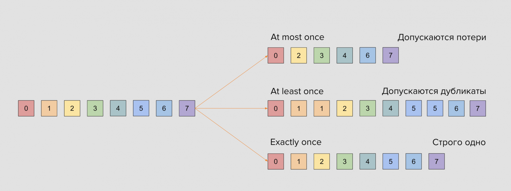

### Гарантии доставки и надёжность в Kafka

---
**Семантика доставки сообщений: At-most-once, At-least-once, Exactly-once**

Семантика доставки (`Delivery Semantics`) и гарантия доставки (`Delivery Guarantee`) в Apache Kafka связаны, но это не одно
и то же.

Семантика доставки (`Delivery Semantics`) это правила, определяющие, сколько раз сообщение будет доставлено потребителю.
Это техническая реализация поведения системы в случае сбоев, повторных отправок или параллельной обработки. И здесь
определены три варианта: `At‑Most‑Once`, `At‑Least‑Once`, `Exactly‑Once`

Гарантия доставки (`Delivery Guarantee`) — это обещание системы обеспечить определенный уровень надежности. Это результат,
который достигается через применение конкретной семантики. Так например гарантия «не потерять данные» реализуется через
семантику `At‑Least‑Once`, а гарантия «точное выполнение операции» требует семантики `Exactly‑Once`.

📌 Таким образом семантика — это инструмент, который вы настраиваете (например, транзакции Kafka), а гарантия — это
результат, который видит бизнес например, «платеж зачислится ровно один раз».



1. `At‑Most‑Once` (не более одного раза): сообщение может быть потеряно, но никогда не дублируется. Продюсер отправляет
   сообщение без подтверждения. Консьюмер автоматически коммитит офсет до обработки сообщения. Если консьюмер упадёт до
   обработки, сообщение будет потеряно. Этот вид доставки используется в системах где потеря данных не является
   критичным — например, метрики, логи).

Для настройки этой гарантии необходимо выключить у Продюсера ожидание подтверждения записи сообщения в Kafka и выключить 
повторы отправки сообщений:
```java
config.put(ProducerConfig.ACKS_CONFIG, "0"); 
config.put(ProducerConfig.RETRIES_CONFIG, 0);
```
Для консьюмера необходимо включить автокоммит офсетов:
```java
config.put(ConsumerConfig.ENABLE_AUTO_COMMIT_CONFIG, true);
```

2. `At‑Least‑Once` (не менее одного раза): сообщение никогда не теряется, но может быть дублировано. Продюсер включает
   подтверждения и повторные попытки. Консьюмер вручную коммитит офсет после обработки. В этом случае может возникнуть
   дублирование сообщений при повторной отправке или сбое. Эту гарантию доставки лучше использовать для систем, где
   потеря данных недопустима (платежи, заказы).

Для настройки этой гарантии необходимо настроить получение подтверждения сообщения Продюсером от всех реплик в кластере 
и установить повторы отправки сообщений:
```java
config.put(ProducerConfig.ACKS_CONFIG, "all");
config.put(ProducerConfig.RETRIES_CONFIG, 3);
```
Для консьюмера необходимо настроить ручной коммит офсетов:
```java
config.put(ConsumerConfig.ENABLE_AUTO_COMMIT_CONFIG, false);
```

3. `Exactly‑Once` (точно один раз): сообщение доставляется ровно один раз, даже при сбоях. Продюсер использует транзакции
   и идемпотентность. Консьюмер читает только зафиксированные транзакции. В этом случае мы нагружаем Kafka управлением
   транзакциями и из‑за этого у нас увеличивается время доставки сообщений. Подобную гарантию доставки рекомендуется
   использовать при построении обработки критичных операций где требуется обработка сообщения строго один раз.

Для настройки этой гарантии необходимо включить режим идемпотентности и использование транзакций у Продюсера:
```java
config.put(ProducerConfig.ENABLE_IDEMPOTENCE_CONFIG, true);
config.put(ProducerConfig.TRANSACTIONAL_ID_CONFIG, "tx-001");
config.put(ProducerConfig.ACKS_CONFIG, "all");
```
Для консьюмера необходимо установить уровень изоляции транзакций read_committed:
```java
config.put(ConsumerConfig.ISOLATION_LEVEL_CONFIG, "read_committed");
```

На первый взгляд самой правильной для любого приложения кажется семантика `exactly-once`, однако это не всегда так.
Например, при передаче партнёрских координат вовсе не обязательно сохранять каждую точку из них, и вполне хватит 
`at-most-once`. А при обработке идемпотентных событий нас вполне может и устроить дубль, если статусная модель предполагает его
корректную обработку.

💡 В распределённых системах у `exactly-once` есть своя цена: высокая надёжность означает большие задержки. 

---

**Идемпотентность, дедупликация**

Идемпотентность — это свойство операции, при котором повторное её выполнение даёт тот же результат, что и первое.

Например, если вы 10 раз отправите команду «установить баланс счёта = 100», результат всегда будет один и тот же —
баланс 100. Но если вы 10 раз отправите «прибавить 10 к балансу», результат будет разным (110, 120, 130 и т.д.) — такая
операция не идемпотентна.

В контексте обработки сообщений идемпотентность означает, что одно и то же сообщение можно обработать несколько раз без
риска нарушения целостности данных (например, дублирования платежа или заказа).

При использовании самой надежной конфигурации `at-least-once`, которая является золотым стандартом для многих систем, 
дубликаты могут возникать в двух ключевых точках отказа распределенной системы.

**⚠️ Источник №1: Повторные отправки со стороны `Producer`**

Представьте простейший сбой сети. Продюсер отправляет сообщение брокеру, брокер успешно его записывает и реплицирует, 
но подтверждение (`acknowledgement`) не успевает дойти до продюсера из-за тайм-аута. С точки зрения продюсера, операция 
провалилась. Его встроенный механизм повторных попыток (retries) отправляет то же самое сообщение еще раз. В результате 
в топике оказывается два идентичных сообщения.

**Сценарий:**

- Producer отправляет сообщение Msg1.
- Брокер-лидер сохраняет Msg1 и отправляет подтверждение.
- Подтверждение теряется из-за временного сбоя сети.
- Producer, не получив подтверждения, считает отправку неуспешной.
- Producer делает повторную попытку и снова отправляет Msg1.
- Результат: В топике Kafka теперь два экземпляра Msg1.

**⚠️ Источник №2: Сбои на стороне `Consumer`**

Это более коварный сценарий. Ваш консьюмер работает в режиме ручного подтверждения (enable.auto.commit=false), что 
является лучшей практикой для at-least-once.

**Сценарий:**

- Consumer получает батч сообщений, включая Msg1.
- Ваше приложение обрабатывает Msg1 (например, списывает деньги со счета и записывает результат в базу данных).
- Приложение аварийно завершает работу до того, как успевает сделать коммит смещения (commitSync/commitAsync) для Msg1.
- После перезапуска Consumer начинает чтение с последнего закоммиченного смещения. Он снова получает Msg1.
- Результат: Ваша система повторно обрабатывает сообщение Msg1, что приводит к двойному списанию средств.

Очевидно, что для построения действительно надежной системы нужно решение, которое атомарно связывает чтение сообщения, 
его обработку и запись результата (включая коммит смещения).

Процесс, направленный на предотвращение дублирования данных, чтобы каждое сообщение обрабатывалось ровно один раз, 
называется дедупликацией сообщений.

Для решения **проблемы №1** в Kafka существует механизм идемпотентности. При его включении каждому продюсеру присваивается
уникальный ID (PID), а каждому сообщению — порядковый номер (sequence number). Порядковый номер
сохраняется в реплицированный лог, поэтому даже в случае сбоя главной реплики любой брокер, берущий на себя эту роль,
также распознаёт, являются ли дублем заново отправленные данные. Брокер отслеживает пару (PID, sequence
number) и отбрасывает сообщения-дубликаты, которые могут возникнуть из-за повторных отправок. Чтобы включить этот режим, 
достаточно добавить всего одну настройку enable.idempotence=true.

Для решения **проблемы №2** используются Транзакции в Kafka. Они позволяют сгруппировать несколько операций чтения, 
обработки и записи в единый атомарный блок. Весь цикл «прочитал из input-topic -> обработал -> записал в output-topic» 
либо полностью успешен, либо полностью отменяется.

💡 Накладные расходы при таком подходе относительно невелики: всего лишь несколько дополнительных числовых полей для
каждого пакета сообщений. Эта функция очень незначительно снижает производительность по сравнению
с неидемпотентным продюсером.

---

**Повторы, retry политики, poison pill**

Даже при использовании идемпотентного продюсера и аккуратного коммита смещений в Kafka остаются ситуации, когда
сообщения обрабатываются повторно. В распределённых системах это нормально, и задача разработчика — не пытаться
полностью избавиться от повторов, а научиться правильно с ними работать.

**⚠️ Повторы сообщений**

Повторы могут возникать по целому ряду причин:
- Сеть или сбой брокера: продюсер не получил ack и повторно отправил сообщение.
- Сбой приложения-консьюмера: сообщение обработалось, но `offset` не успел зафиксироваться, и после рестарта консьюмер
получает его снова.
- Ошибки на стороне потребителя: при exception сообщение возвращается в очередь и читается повторно.

Kafka проектировалась с пониманием того, что такие ситуации неизбежны. Поэтому базовая гарантия доставки (`at-least-once`)
всегда подразумевает возможность дубликатов.

**🔹Retry-политики**

Retry-механизмы позволяют дать сообщению несколько попыток «пройти» обработку. Это особенно полезно в случае временных
проблем: например, недоступна база данных или внешний сервис.

В Kafka (и особенно в Spring Kafka) retry-политика может настраиваться гибко:
- Количество повторов: сколько раз попробовать обработать сообщение.
- Интервал между попытками: фиксированный или экспоненциальный backoff.
- `Dead Letter Topic (DLT)`: специальный топик, куда сообщение отправляется после исчерпания всех попыток.

Пример конфигурации Spring Kafka:
```java
@Bean
public DefaultErrorHandler errorHandler(KafkaTemplate<String, String> template) {
    var recoverer = new DeadLetterPublishingRecoverer(template);
    return new DefaultErrorHandler(recoverer, new FixedBackOff(2000L, 5));
}
```

В этом примере у сообщения будет 5 повторных попыток с интервалом 2 секунды. Если все они неудачны — сообщение
автоматически попадёт в DLT.

**🔹 Poison pill**

`Poison pill` (ядовитая таблетка) — это сообщение, которое по каким-то причинам никогда не сможет быть обработано.

Например:
- сообщение повреждено;
- формат не соответствует ожидаемой схеме;
- бизнес-логика приложения всегда падает на конкретных данных.

Если не обрабатывать такие сообщения отдельно, система может зациклиться: консьюмер будет бесконечно пытаться обработать
одно и то же сообщение и падать.

Именно поэтому для надёжных систем жизненно важно использовать DLT (Dead Letter Topic). Все «ядовитые» сообщения уходят
туда, и уже потом разработчики могут разбирать их вручную, чинить данные или корректировать бизнес-логику.

Необходимо соблюдать баланс между `retry` и устойчивостью:
- Слишком мало повторов → риск потерять сообщение из-за временного сбоя.
- Слишком много повторов → перегрузка системы, зацикливание на «ядовитых» сообщениях.

❗ Поэтому на практике выбирают разумное число попыток (3–5) и всегда включают Dead Letter Topic как «последнюю линию
обороны».

---

### Вопросы
- Какие существуют семантики доставки сообщений?
- Что означает каждая из них и в каких случаях используется?
- Что такое идемпотентность в контексте обработки сообщений?
- Какие два ключевых источника дубликатов сообщений в `Kafka`?
- Что такое дедупликация сообщений и как осуществляется?
- Какие могут быть причины возникновения повторных сообщений?
- Что такое `poison pill` (с примерами)?

---

### Упражнения
1. Настроить `OrderGatewayService` с параметрами `acks=all`, `enable.idempotence=true`, `transactional.id=order-tx-1`.
2. В `OrderProcessorService` отключить авто-коммит и реализовать ручной коммит оффсета. 
3. Создать новый топик `orders.reliable` с двумя репликами и `min.insync.replicas=2`. 
4. Протестировать все три режима доставки (`at most once`, `at least once`, `exactly once`). 
5. Смоделировать сбой `Kafka` и проверить устойчивость приложения.
   - Запустите оба сервиса и убедитесь, что сообщения обрабатываются. 
   - Остановите `Kafka`: 
   ```java 
   docker stop kafka 
   ```
   - Наблюдайте за логами — продюсер должен выдавать ошибки, консьюмер ждать. 
   - Запустите `Kafka` снова: 
   ```java
   docker start kafka
   ```
   - Проверьте, восстановилась ли обработка сообщений и не потерялись ли данные.
6. Обработка `Poison Pill` сообщений 
   - Создайте специальное сообщение с некорректными или «опасными» данными (`Poison Pill`). 
   - Отправьте его в топик `orders.new`. 
   - Настройте `OrderProcessorService` так, чтобы он не падал при получении такого сообщения: пропускал сообщение с логированием ошибки, или помещал его в отдельный топик `orders.failed`. 
   - Проверьте, что последующие корректные сообщения продолжают обрабатываться. 
   - Добавить логирование времени отправки и получения сообщения, чтобы измерить задержку доставки.
   
---

## 📚 Полезные ссылки и материалы

### 📖 **Официальная документация**
- [Apache Kafka Documentation](https://kafka.apache.org/documentation/) - Полная документация Apache Kafka
- [Confluent Docs: Delivery Semantics](https://docs.confluent.io/kafka/design/delivery-semantics.html) - Документация по гарантиям доставки

### 🔥 **Лучшие статьи с Хабра (2024-2025)**

- [Kafka за 20 мннут](https://habr.com/ru/companies/kuper/articles/738634/) - основы Kafka, гарантии доставки
- [Apache Kafka в гарантиях](https://habr.com/ru/companies/otus/articles/930372/?ysclid=mg3v2cvuqk270931942) - разбор гарантий доставки Kafka
- [Apache Kafka: гарантии доставки и лучшие практики](https://habr.com/ru/articles/853652/) - разбор At-most-once, At-least-once, Exactly-once, настройки продюсера и консьюмера
- [Семантики доставки событий в распределённых системах](https://habr.com/ru/companies/avito/articles/755014/) - подробный разбор семантик доставки в распределённых системах, включая Kafka
- [Poison Message и Dead Letter Queue](https://habr.com/ru/articles/587830/) - как обрабатывать «ядовитые» сообщения, DLT как решение
- [Типовые проблемы Kafka и их решения](https://habr.com/ru/companies/otus/articles/861734/) - retry, ошибки, отказоустойчивость

### 🛠 **Инструменты разработки**
- [Confluent Platform](https://www.confluent.io/platform/) - Коммерческая платформа на базе Kafka
- [Kafka Tool](https://www.kafkatool.com/) - GUI клиент для Kafka

### 🎯 **Практические примеры**
- [Spring Kafka Examples](https://github.com/spring-projects/spring-kafka/tree/main/spring-kafka-sample) - Официальные примеры Spring Kafka