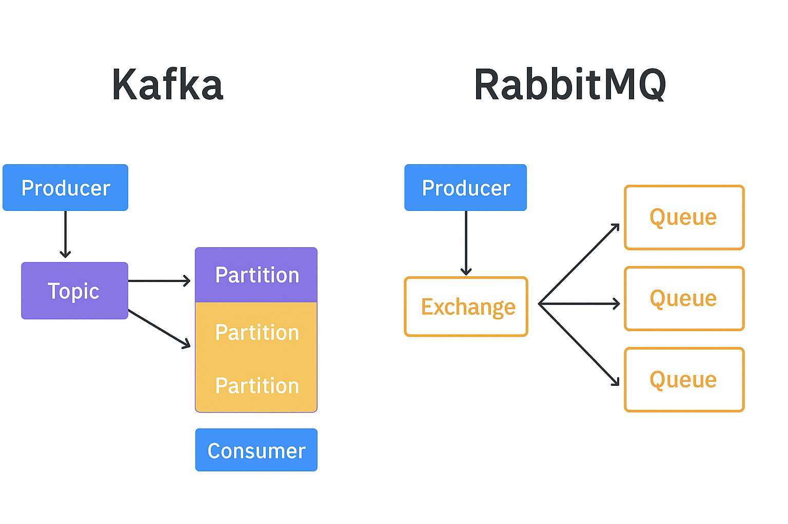

#### Kafka vs RabbitMQ

---
**🔹 Сравнение по ключевым характеристикам**

| Характеристика         | Kafka                                                                         | RabbitMQ                                                                             | 
|------------------------|-------------------------------------------------------------------------------|--------------------------------------------------------------------------------------|
| Модель                 | Publish/Subscribe + Log (событийный журнал)                                   | Очередь сообщений (Queue), Pub/Sub через Exchange                                    | 
| Порядок сообщений      | Гарантируется внутри партиции, глобальный порядок не гарантирован             | Гарантируется FIFO внутри очереди                                                    | 
| Хранение сообщений     | Сообщения хранятся на диске, долго; потребители могут читать повторно         | Сообщения удаляются после доставки, могут быть durable для кратковременного хранения | 
| Маршрутизация          | Нет сложной маршрутизации; логическая маршрутизация через топики              | Exchange + Bindings + Routing Key позволяют гибко маршрутизировать                   |         
| Транзакции             | Поддержка атомарной записи в несколько топиков                                | Ограниченная поддержка транзакций (publisher confirms, ack/nack)                     |
| Сложность эксплуатации | Высокая: требуется настройка кластеров, zookeeper/metadata, партиционирование | Средняя: проще в настройке и мониторинге через Management UI                         |
| Масштабирование        | Горизонтальное, через партиции и репликацию                                   | Горизонтальное через shovels, federation, кластеры                                   |

`Kafka` и `RabbitMQ` отличаются по модели обмена, хранению и обработке сообщений. `Kafka` ориентирована на высокопроизводительную обработку потоков данных с долговременным хранением и возможностью многократного чтения сообщений, что удобно для аналитики и событийных систем. `RabbitMQ` обеспечивает надежную доставку и гибкую маршрутизацию через `Exchange` и `Queue`, удаляя сообщение после получения, что подходит для одноразовой обработки.

Выбор платформы зависит от сценария: `Kafka` — для высокой нагрузки, повторного чтения и масштабируемых потоков; `RabbitMQ` — для гарантированной доставки, сложной маршрутизации и простоты эксплуатации. Масштабирование Kafka происходит через партиции и репликацию, RabbitMQ — через `federation` или `shovels`. Управление `Kafka` требует настройки кластера и метаданных, `RabbitMQ` проще благодаря встроенному UI и мониторингу.

---
**Типовые кейсы**


| Характеристика / Сценарий                      | Kafka                                                                            | RabbitMQ                                                                      | 
|------------------------------------------------|----------------------------------------------------------------------------------|-------------------------------------------------------------------------------|
| События домена / Event Sourcing                | ✅ Отлично подходит: события сохраняются в логе, можно восстанавливать состояние  | ⚠️ Возможно, но хранение событий кратковременно; RabbitMQ больше для передачи | 
| Потоковая обработка данных (Stream Processing) | ✅ Идеально: потребители читают поток данных в реальном времени                   | ⚠️ Не оптимально: RabbitMQ ориентирован на очереди и маршрутизацию задач      | 
| Аналитика и log aggregation                    | ✅ Высокая пропускная способность, централизованное хранение сообщений            | ⚠️ Можно, но не предназначен для больших потоков и аналитики                  | 
| Обработка задач между сервисами                | ⚠️ Возможно, но сложнее реализовать маршрутизацию                                | ✅ Идеально: exchange + binding позволяют направлять задачи в нужные очереди   |         
| Интеграция микросервисов                       | ⚠️ Используется для событийной интеграции, но нет сложной маршрутизации          | ✅ Отлично: Direct/Topic/Fanout/Headers обеспечивают гибкую маршрутизацию      |
| Асинхронные очереди задач (Task Queues)        | ⚠️ Возможно, но логи сообщений сохраняются, нет удобных очередей                 | ✅ Основное применение RabbitMQ: управление задачами и порядком обработки      |
| Сценарии с большим объёмом данных              | ✅ Высокая пропускная способность, масштабируемость                               | ⚠️ Подходит для умеренного объёма и сложной маршрутизации                     |
| Порядок сообщений                              | ✅ Гарантируется внутри партиции                                                  | ✅ Гарантируется FIFO внутри очереди                                           |
| Сложная маршрутизация                          | ⚠️ Ограничена (топики), сложнее реализовать                                      | ✅ Полностью поддерживается через exchange и binding                           |

**Выводы для выбора**

`Kafka` → если нужно обрабатывать события в потоках, хранить историю событий, масштабироваться на миллионы сообщений, аналитика в реальном времени.

`RabbitMQ` → если нужна гибкая маршрутизация сообщений, очереди задач, гарантированный порядок и надёжная доставка, интеграция микросервисов.

---
**Kafka vs RabbitMQ: поток данных**



**Kafka**
```java
Producer → Topic → Partitions → Consumer
```

- `Producer` пишет в `Topic`.

- `Topic` разделён на `Partitions` для параллельной обработки.

- `Consumer` читает сообщения, отслеживая свой `offset`.

- Сообщения сохраняются на диске, можно читать многократно.

**RabbitMQ**
```java
Producer → Exchange → Queue → Consumer
```

- `Producer` отправляет в `Exchange`.

- `Exchange` маршрутизирует сообщения в одну или несколько `Queues`.

- `Consumer` получает сообщение из `Queue` и подтверждает получение.

- Сообщение исчезает из `Queue` после успешного получения (если включён `ack`).

**💡Сравнение потоков**

`Kafka`: сообщения остаются, многократное чтение, высокая пропускная способность.

`RabbitMQ`: доставка с подтверждением, гибкая маршрутизация, надёжная обработка.


---
### 🎯 Практика: Сравниваем RabbitMQ и Kafka

**🔹 Шаг 1. Создаём микросервисы🔹**
- `OrderService` — публикует заказы. 
- `NotificationService` — читает сообщения и имитирует уведомления пользователю.

**🔹 Шаг 2. Реализация для RabbitMQ🔹**

`Producer (OrderService)`:
- Подключается к `RabbitMQ` через `AMQP`: 
```java
<dependency>
    <groupId>com.rabbitmq</groupId>
    <artifactId>amqp-client</artifactId>
    <version>5.21.0</version>
</dependency>
```
⚠️ Что такое `AMQP` объясняется в следующей главе: [8. Spring AMQP](8_spring_amqp.md) !

- Объявляет `exchange orders.exchange` и публикует сообщения с `routing key order.created`.
- Формат сообщения:
```java
{
  "orderId": "123",
  "email": "user@mail.com",
  "amount": 2500,
  "sentAt": 1739440331123
}
```
`Consumer NotificationService)`:
- Подписывается на очередь `notifications`. 
- Получает сообщения, вычисляет задержку доставки (`now - sentAt`). 
- После успешной обработки отправляет `ack`. 
- При сбое — не отправляет `ack`, чтобы `RabbitMQ` повторно доставил сообщение.

**🔹 Шаг 3. Реализация для Kafka🔹**

`ProducerKafka`:
- Отправляет такие же JSON-сообщения в топик orders.

`ConsumerKafka`:
- Подписывается на `orders`. 
- Читает сообщения, выводит задержку. 
- Управляет offset’ами вручную (`commitSync`).

💡 Как итог: `RabbitMQ` — очередь задач (каждое сообщение обрабатывается и исчезает).
`Kafka` — поток событий (всё сохраняется, можно перечитывать).

---
### Вопросы
- В чем ключевое различие между моделью обработки сообщений `Kafka` и `RabbitMQ`?
- Как хранение сообщений влияет на возможность повторного чтения в `Kafka` и `RabbitMQ`?
- В каких сценариях лучше использовать `RabbitMQ`, а в каких `Kafka`?
- Как реализуется масштабирование в `Kafka` и `RabbitMQ`?
- Какие ограничения существуют по маршрутизации в `Kafka` по сравнению с `RabbitMQ`?

---
### Упражнения

---

1. Реализовать `Producer` и `Consumer` для `RabbitMQ` и `Kafka`
2. Провести эксперименты и сравнения 
   - Отправка 10 сообщений (посмотреть на порядок сообщений)
   - Перезапуск `consumer` (ожидаемый результат: `RabbitMQ` повторно доставит не-ack'нутые, `Kafka` прочитает по offset)
   - Остановка брокера (ожидаемый результат: `Kafka` ждёт восстановления, `Rabbit` теряет неподтверждённые)


---
## 📚 Дополнительные материалы и ссылки
### 🔥 **Лучшие статьи по теме (2024-2025)**
- [Kafka vs RabbitMQ](https://habr.com/ru/companies/itsumma/articles/416629/) - RabbitMQ против Kafka: два разных подхода к обмену сообщениями
- [Kafka vs RabbitMQ Analytics ](https://vc.ru/dev/869548-kafka-vs-rabbitmq-chto-nuzhno-znat-analitiku-pro-brokery-soobshenii) - Kafka vs RabbitMQ: что нужно знать аналитику про брокеры сообщений

### 📊 **Источники информации**
Материал курса основан на:
- Практических статьях и кейсах компаний 
- Лучших практиках Java сообщества
- Актуальных тенденциях развития экосистемы в 2025 году
- Официальной документации и гайдах по Apache Kafka и RabbitMQ
- Публикацииях экспертов по архитектуре микросервисов и потоковой обработке данных

